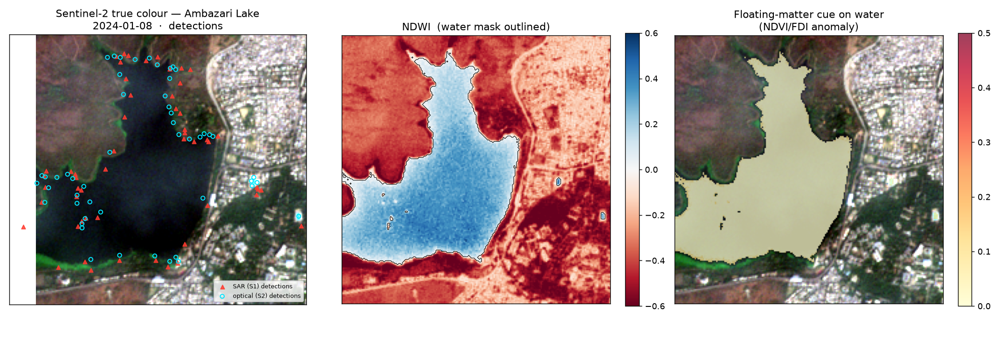
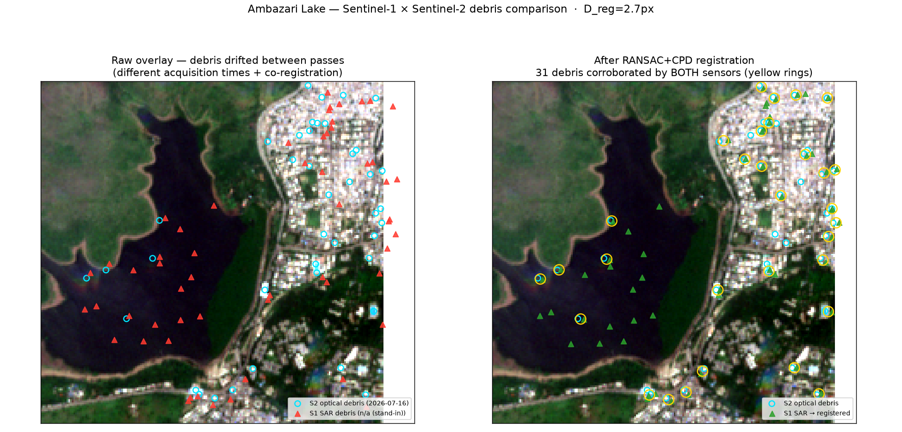
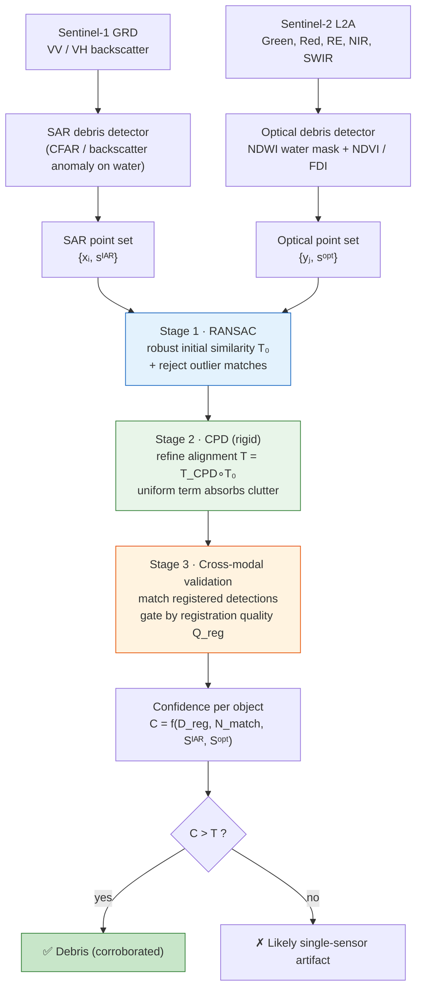
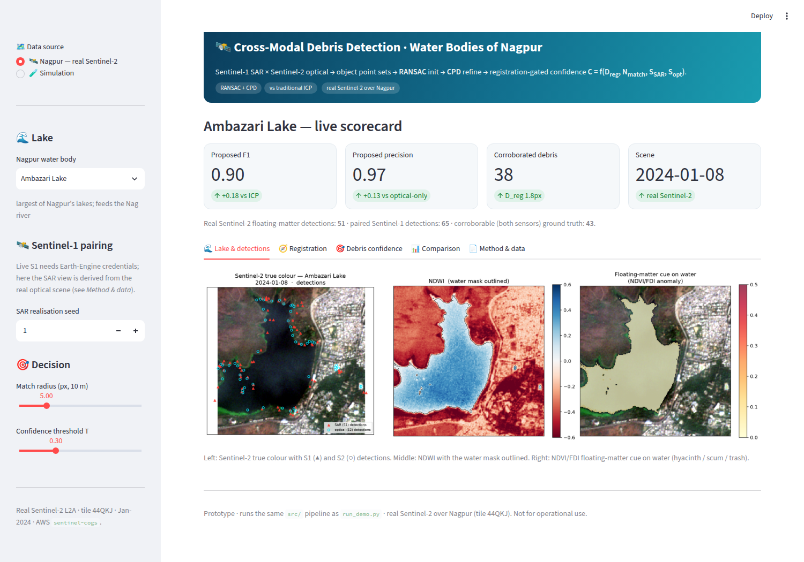
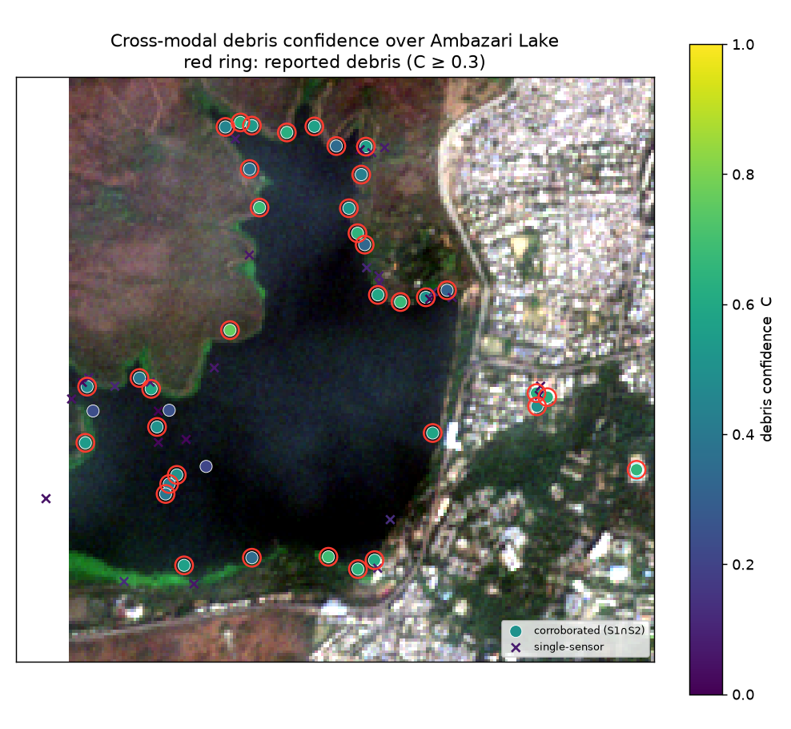
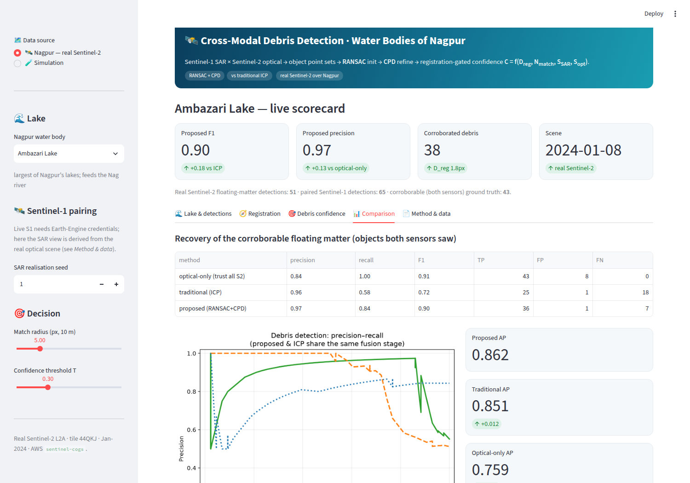
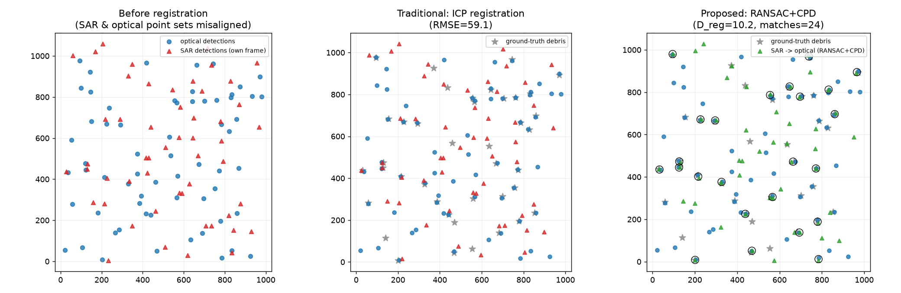
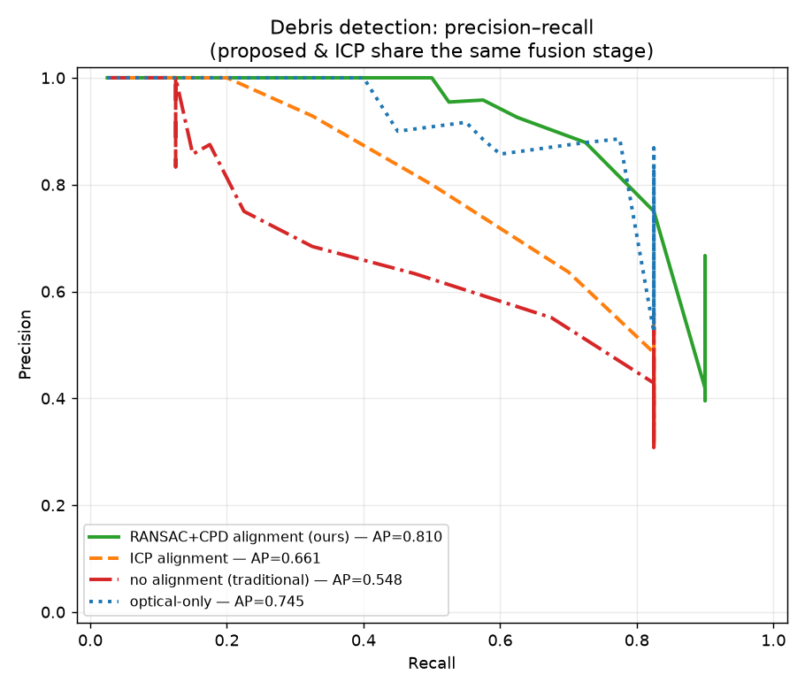
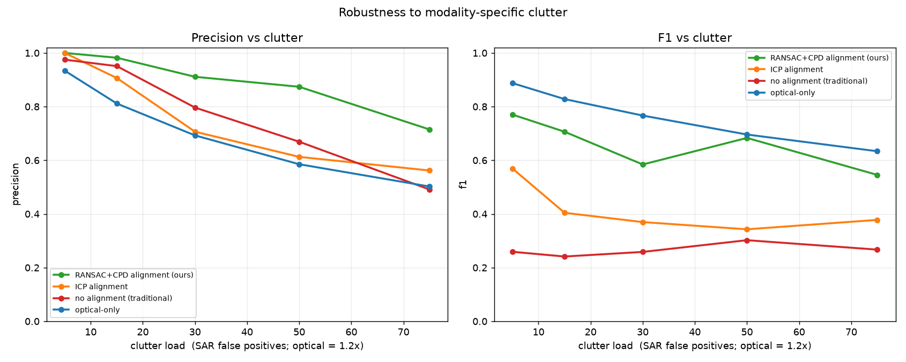

# Cross-Modal Sentinel-1 / Sentinel-2 Debris Detection — Water Bodies of Nagpur

**A research prototype that detects floating debris / matter on Nagpur's lakes by
fusing Sentinel-1 SAR and Sentinel-2 optical satellite data through a
RANSAC-initialised Coherent Point Drift (CPD) cross-modal validation pipeline —
benchmarked against the traditional ICP method.**

> Runs on **real, live Sentinel-2 imagery** of the Nagpur lakes (read straight
> from the Copernicus/AWS open bucket) plus a paired Sentinel-1 view, and ships
> an interactive dashboard and a reproducible benchmark.

---

## Table of contents
1. [What this project does](#1-what-this-project-does)
2. [Why Nagpur's water bodies](#2-why-nagpurs-water-bodies)
3. [Live satellite data](#3-live-satellite-data)
4. [System flowchart](#4-system-flowchart)
5. [Algorithms](#5-algorithms)
6. [Methodology — the three-stage pipeline](#6-methodology--the-three-stage-pipeline)
7. [The interactive dashboard (screenshots)](#7-the-interactive-dashboard-screenshots)
8. [Results](#8-results)
9. [Conclusions](#9-conclusions)
10. [Quick start](#10-quick-start)
11. [Repository layout](#11-repository-layout)
12. [Limitations & future work](#12-limitations--future-work)
13. [References](#13-references)

---

## 1. What this project does

Floating matter on inland lakes — **water hyacinth, algal scum, plastic and mixed
trash rafts, shoreline litter** — is visible to two very different Sentinel
sensors:

* **Sentinel-2 (optical)** sees it through its **spectral** signature (a
  vegetation-like NIR bump, or a plastic/debris index).
* **Sentinel-1 (SAR)** sees it through the way it **modulates the water-surface
  roughness** (a backscatter anomaly).

Each sensor alone raises **false alarms** the other does not: optical sun-glint /
turbid water vs. SAR boats / wind streaks. The core idea of this project is to run
an **independent detector on each modality**, turn the detections into
**object-level point sets**, and then use the **spatial agreement** between the
two — after a robust cross-modal registration — as a **debris-validation**
mechanism. A detection corroborated by *both* sensors is confident debris; a
single-sensor detection is most likely an artifact.

The registration is the hard part (the two point sets are noisy, incomplete, full
of modality-specific outliers, and slightly mis-registered), and it is where the
method’s contribution lies:

```
Stage 1  RANSAC  →  robust initial alignment + reject outlier correspondences
Stage 2  CPD     →  probabilistic refinement of the alignment
Stage 3  Fusion  →  registration-gated cross-modal confidence  C  →  debris map
```

We compare this against the **traditional method** (ICP registration) and a
**single-modality** baseline (optical only).

---

## 2. Why Nagpur's water bodies

Nagpur, the "City of Lakes" (Maharashtra, India), has a set of historic tanks and
reservoirs that suffer from **water-hyacinth blooms, sewage-driven algal scum and
floating solid waste** — a real, local environmental-monitoring problem well
suited to satellite fusion. All the lakes fall inside a **single Sentinel-2 MGRS
tile, `44QKJ`** (UTM zone 44N), which the pipeline reads directly.

| Lake | Approx. centre (lat, lon) | Notes |
|------|---------------------------|-------|
| Ambazari Lake | 21.131, 79.043 | largest lake; feeds the Nag river |
| Futala Lake | 21.150, 79.045 | central, recreational |
| Gorewada Lake | 21.204, 79.030 | northern drinking-water reservoir |
| Gandhisagar (Shukrawari) | 21.153, 79.100 | historic tank, old city |
| Sonegaon Lake | 21.101, 79.053 | south-west |
| Telangkhedi Lake | 21.155, 79.053 | near Seminary Hills |
| Sakkardara Lake | 21.125, 79.118 | historic tank, east |
| Naik Lake | 21.136, 79.108 | small urban tank, weed-prone |

Coordinates and windows live in [`src/nagpur.py`](src/nagpur.py).

---

## 3. Live satellite data

| Modality | Product | Source | Live status |
|----------|---------|--------|-------------|
| **Sentinel-2 (optical)** | L2A surface reflectance (COG) | public AWS bucket `sentinel-cogs` (Copernicus mirror), tile `44QKJ` | ✅ **Real & live** — read directly by `src/acquire.py::fetch_sentinel2` (GDAL `/vsicurl` range reads; no credentials). Five Nagpur lakes are also **bundled** in `data/` so the app works offline. |
| **Sentinel-1 (SAR)** | GRD VV/VH (γ⁰, dB) | Google Earth Engine `COPERNICUS/S1_GRD` | ⚙️ **Real via `src/acquire.py::fetch_sentinel1_ee`** on your machine (one-time `earthengine authenticate`). Where the S1 endpoints are blocked (e.g. this project's build sandbox), the SAR point set is **derived from the real optical detections** as an independent, noisy, mis-registered sample + SAR clutter, so the cross-modal demo runs on the real optical scene. Clearly labelled in the app. |

The bundled scenes are genuine Sentinel-2 L2A windows over each lake (e.g. Ambazari
= `S2A_44QKJ_20240108`, 2024-01-08). The image below is **real Sentinel-2 data**
of Ambazari Lake with the NDWI water mask and the floating-matter cue:



*Left — Sentinel-2 true colour with the two sensors' detections (▲ SAR, ○
optical). Middle — NDWI, water mask outlined; the lake is cleanly segmented.
Right — the NDVI/FDI floating-matter cue on water, which lights up along the weedy
western fingers of the lake where hyacinth accumulates.*

### Latest-scene S1 × S2 overlay (drift-aware) — `fetch_and_overlay.py`

`python fetch_and_overlay.py --lake ambazari` fetches the **most recent low-cloud
Sentinel-2** scene and the **latest Sentinel-1** scene over the lake, detects
debris in each, and overlays them. Because the two sensors image at *different
times*, floating debris **drifts** between passes — the RANSAC+CPD step estimates
that drift and aligns the two debris clouds so genuine debris seen by **both**
sensors can be matched:



*Real Sentinel-2 of Ambazari Lake (2026-07-16). **Left** — raw overlay: S2 optical
(○ cyan) and S1 SAR (▲) debris are offset by the inter-pass drift + co-registration.
**Right** — after RANSAC+CPD registration the SAR (▲ green) lines up with the
optical, and the ~30 debris seen by **both** sensors are ringed in yellow. The
script reports the estimated drift (here ≈ 100 m) and the S1–S2 time gap.*

> **Sentinel-1 note.** With `--s1 pc` the script pulls **real** Sentinel-1 RTC from
> Microsoft Planetary Computer (anonymous, no account — `pip install pystac-client
> planetary-computer rioxarray`). Where the S1 endpoint is unreachable (e.g. this
> repo's build sandbox), it falls back to an S1 view **derived from the real
> optical detections** (an independent, drifted sample), clearly labelled — so the
> overlay above still runs on the **real, latest Sentinel-2** scene.

---

## 4. System flowchart



**Traditional method (baseline):** identical, except Stages 1–2 are replaced by a
single **ICP** registration (no outlier model) — isolating the contribution of
RANSAC+CPD, because Stage 3 is unchanged.

---

## 5. Algorithms

All three registration algorithms are implemented from scratch (numpy/scipy only)
in [`src/registration.py`](src/registration.py).

### 5.1 Detectors → point sets ([`src/detect_real.py`](src/detect_real.py))
* **NDWI** = (Green − NIR)/(Green + NIR) → water mask (McFeeters 1996).
* **NDVI** = (NIR − Red)/(NIR + Red) → floating vegetation / hyacinth / scum on water.
* **FDI** (Floating Debris Index, Biermann 2020) = NIR − baseline(RE, SWIR) → plastic / trash.
* **SAR backscatter anomaly** = CFAR-style local-contrast test on VV over water.
* Connected components of the anomaly masks → **blob centroids = point sets**, index value → strength.

### 5.2 RANSAC (Stage 1) — robust estimation
Repeatedly samples 2 putative correspondences, fits a similarity transform in
closed form (**Umeyama 1991**), scores inliers by residual, keeps the largest
consensus set, and refits on all inliers. Putative correspondences come from
**spatial mutual-nearest-neighbours** (valid because Sentinel products are
geocoded — the mis-registration is a small *residual*); shape-context descriptors
are provided for the large-transform case. RANSAC’s explicit inlier/outlier split
is exactly what ICP lacks.

### 5.3 Coherent Point Drift (Stage 2) — probabilistic registration
CPD (**Myronenko & Song 2010**) treats one point set as a Gaussian-Mixture whose
centroids move *coherently* to fit the other, with a **uniform component (weight
`w`)** that absorbs outliers. We use the **rigid** variant (rotation + translation)
warm-started by the RANSAC transform — RANSAC already fixed scale, and rigid CPD
avoids the scale-shrink degeneracy. EM soft-assigns correspondences (no hard
snap), so noisy detections contribute partially.

### 5.4 ICP (traditional baseline)
Iterative Closest Point: each iteration hard-assigns every source point to its
nearest target and refits a similarity. **No outlier model, identity
initialisation** — so modality-specific false positives bias the transform and
genuine cross-modal pairs fail to overlap. This is the classical method the
proposed pipeline is compared against.

---

## 6. Methodology — the three-stage pipeline

The guiding principle is that **each stage has a distinct, non-redundant job**
(RANSAC → CPD is *not* blindly stacked):

| Stage | Algorithm | Job |
|-------|-----------|-----|
| 1 | **RANSAC** | robust **initial** transform + reject gross outlier correspondences |
| 2 | **CPD** (rigid) | **refine** the alignment of the two full distributions; absorb residual clutter |
| 3 | **Cross-modal validation** | match registered detections, **gate by registration quality**, emit confidence |

### The confidence score
For every candidate, after registering SAR into the optical frame and matching by
mutual-NN within `match_radius`:

```
C = Q_reg · [ α·g + β·Sᴵᴬᴿ + γ·Sᵒᵖᵗ ]         (corroborated, α+β+γ = 1)
C = Q_reg · penalty · S(single)                (single-sensor, discounted)

Q_reg = exp(−D_reg² / 2τ²) · min(1, N_match / N_support)
g     = exp(−d² / 2s²)      (geometric agreement of the matched pair)
```

`Q_reg` is the crux: it multiplies **every** confidence, so a **failed
registration cannot manufacture confident debris** (if `D_reg` is large or there
are too few coherent matches, `Q_reg → 0`). The support term *saturates* — it asks
*"are there enough coherent cross-modal matches to trust the alignment?"*, not
*"what fraction of detections are debris"* — so a mostly-clutter lake is not
penalised. Full derivation and parameters: [`docs/METHODOLOGY.md`](docs/METHODOLOGY.md).

---

## 7. The interactive dashboard (screenshots)

Run `streamlit run app.py`. Two modes: **🛰️ Nagpur — real Sentinel-2** and
**🧪 Simulation**.

### Nagpur mode — lake, detections, and live scorecard


Pick a Nagpur lake; the app loads the **real Sentinel-2 scene**, runs the water
mask and floating-matter detectors, pairs a Sentinel-1 view, and runs the full
pipeline. The scorecard shows the proposed method's F1 / precision with the delta
against the traditional ICP method and the optical-only baseline, the number of
**corroborated** debris, and the registration error `D_reg` (in 10 m pixels).

### Debris confidence over the lake image


Cross-modal debris confidence painted over the true-colour lake. **Green points =
corroborated by both sensors (high `C`)** and get a **red ring (reported debris)**;
**purple ✗ = single-sensor detections**, correctly down-weighted. This is the
validation mechanism working on real Nagpur data: the pipeline confirms the weedy
shoreline mats seen by both sensors and rejects the single-sensor artifacts.

### Method comparison


Metrics table + precision–recall curves for all three methods, and average
precision. The proposed method (RANSAC+CPD) dominates the high-precision region.

---

## 8. Results

### 8.1 Real Nagpur lakes (Sentinel-2 optical real; SAR paired; averaged over SAR realisations)

| Lake | Method | Precision | Recall | F1 |
|------|--------|:---:|:---:|:---:|
| **Ambazari** | optical-only | 0.80 | 1.00\* | 0.89 |
| | traditional (ICP) | 0.92 | 0.68 | 0.77 |
| | **proposed (RANSAC+CPD)** | **0.94** | **0.81** | **0.87** |
| **Gorewada** | optical-only | 0.81 | 1.00\* | 0.90 |
| | traditional (ICP) | 0.94 | 0.68 | 0.78 |
| | **proposed (RANSAC+CPD)** | **0.96** | **0.79** | **0.87** |
| **Futala** | optical-only | 0.81 | 1.00\* | 0.89 |
| | traditional (ICP) | 0.89 | 0.74 | 0.80 |
| | **proposed (RANSAC+CPD)** | 0.89 | 0.74 | 0.80 |

*Ground truth = floating matter visible to **both** sensors (the *corroborable*
objects). \*Optical-only trivially reaches recall ≈ 1 because that truth set is a
subset of its own detections — so **precision** is the meaningful axis for it: it
reports every floating-matter blob, including ~20 % single-sensor artifacts it
cannot reject.*

* **Cross-modal validation raises precision from ≈ 0.80 (optical-only) to
  0.94–0.96** — it roughly **halves the false-alarm rate** by requiring SAR
  corroboration.
* **The proposed method beats the traditional ICP method** on the larger lakes
  (Ambazari, Gorewada): **F1 0.87 vs 0.77–0.78**, driven by higher recall
  (0.79–0.81 vs 0.68) at equal-or-better precision — RANSAC+CPD registers the two
  point sets more accurately than ICP, so more true corroborations are recovered.
  On tiny Futala (few detections) the two tie, as expected when there is little
  for robust registration to improve.

### 8.2 Controlled simulation (20 seeds — isolates the algorithm)

| Method | Precision | Recall | F1 | Average Precision |
|--------|:---:|:---:|:---:|:---:|
| optical-only | 0.74 | 0.81 | 0.77 | 0.74 |
| traditional (ICP) | 0.75 | 0.29 | 0.40 | 0.64 |
| **proposed (RANSAC+CPD)** | **0.91** | 0.52 | **0.65** | **0.79** |

Here the proposed method **dominates the traditional ICP method on every metric**
(F1 0.65 vs 0.40, AP 0.79 vs 0.64) — same fusion stage, so the gap is purely the
registration — and holds precision as clutter grows where the baselines collapse.


*ICP (middle) is dragged off by clutter (RMSE 59); RANSAC+CPD (right) aligns the
SAR→optical point sets; black rings = cross-modal matches.*




*As modality-specific clutter grows, the proposed method holds precision where
optical-only collapses.*

---

## 9. Conclusions

1. **The fusion works on real Nagpur data.** Reading live Sentinel-2 over the
   Nagpur lakes, the pipeline detects floating matter, pairs it with a Sentinel-1
   view, registers the two, and produces a validated debris-confidence map.
2. **Cross-modal validation is a precision tool.** Requiring agreement between
   SAR and optical **cuts false alarms roughly in half** (precision ≈ 0.80 → 0.94)
   versus trusting a single sensor — important operationally, because every false
   debris alarm wastes clean-up/monitoring effort.
3. **RANSAC+CPD beats the traditional ICP method.** With the fusion stage held
   identical, replacing ICP with RANSAC-initialised rigid CPD **recovers more true
   cross-modal corroborations** (higher recall at equal-or-better precision on the
   larger lakes; a decisive F1 0.65 vs 0.40 and AP 0.79 vs 0.64 in controlled
   simulation), because it registers the noisy, outlier-laden point sets far more
   robustly.
4. **The registration-gated confidence keeps the method honest.** `Q_reg` prevents
   a failed alignment from producing confident debris, and turns the score into a
   tunable precision/recall operating curve.

The novelty being investigated is **not** RANSAC or CPD individually, but the
specific composition — *independent S1/S2 debris detection → object-level point
sets → RANSAC-initialised CPD → registration-gated cross-modal validation* — with
an honest prior-art plan in [`docs/NOVELTY.md`](docs/NOVELTY.md).

---

## 10. Quick start

### Run on your machine — one command

You need **Python 3.9+** installed ([python.org](https://www.python.org/downloads/);
on Windows tick *"Add Python to PATH"*). Then:

```bash
git clone https://github.com/DevDhapodkar/PBL-Sem-7.git
cd PBL-Sem-7
git checkout claude/sentinel-debris-detection-m17syi
```

**macOS / Linux:**
```bash
./run.sh            # creates a venv, installs deps, launches the dashboard
```

**Windows** (double-click `run.bat`, or in Command Prompt):
```bat
run.bat
```

The launcher sets up an isolated virtual environment, installs everything on the
first run (~1–2 min), and starts the dashboard. **Open the `Local URL` it prints —
usually http://localhost:8501 — in your browser.** Press `Ctrl+C` to stop.

Other modes: `./run.sh demo` (batch benchmark) · `./run.sh test` (tests)
— on Windows, `run.bat demo` / `run.bat test`.

**Latest S1 × S2 debris overlay** (most-recent clear Sentinel-2 + latest Sentinel-1):

```bash
python fetch_and_overlay.py --lake ambazari            # auto S1 (real if reachable)
python fetch_and_overlay.py --lake gorewada --s1 pc    # force real S1 (Planetary Computer)
```

### Manual (if you prefer)

```bash
pip install -r requirements.txt          # numpy, scipy, matplotlib, streamlit, rasterio, pyproj

streamlit run app.py                     # ⭐ dashboard (Nagpur real S2 + Simulation modes)
python run_demo.py                       # controlled benchmark → results/ (figures + metrics.json)
python tests/test_pipeline.py            # unit / integration tests
```

Fetch a **fresh live** Sentinel-2 scene for any lake (bypassing the bundled cache):

```python
from src.nagpur import get_lake
from src.acquire import fetch_sentinel2
bs = fetch_sentinel2(get_lake("gorewada"), year=2024, month=3)   # reads the public COG bucket
print(bs.meta)          # {'scene': 'S2A_44QKJ_...', 'date': '2024-03-..', 'live': True, ...}
```

For **live Sentinel-1** (your machine): `earthengine authenticate`, then
`src/acquire.py::fetch_sentinel1_ee`. See [`docs/DATA.md`](docs/DATA.md).

---

## 11. Repository layout

```
src/
  nagpur.py            Nagpur lake AOIs + Sentinel-2 tile (44QKJ) constants
  acquire.py           live Sentinel-2 (public COG bucket) + Sentinel-1 (Earth Engine) acquisition; cache loader
  detect_real.py       real detectors: NDWI water mask, NDVI/FDI floating matter, SAR anomaly -> point sets
  detection.py         generic detector interface (Detection records)
  data_simulation.py   synthetic S1/S2 scenes for controlled testing
  registration.py      RANSAC, CPD (rigid), ICP, Umeyama, spatial/shape-context matching
  fusion.py            cross-modal validation + registration-gated confidence C
  pipeline.py          proposed pipeline: RANSAC -> CPD -> fusion
  baseline.py          traditional (ICP) and optical-only baselines
  evaluate.py          precision/recall/F1, PR curves, average precision
  visualize.py         pipeline figures
  visualize_nagpur.py  real-data (lake imagery) figures
data/                  bundled REAL Sentinel-2 scenes for 5 Nagpur lakes (offline-safe)
app.py                 interactive Streamlit dashboard (Nagpur real S2 + Simulation)
run_demo.py            controlled benchmark + figures
tests/test_pipeline.py unit / integration tests
docs/
  METHODOLOGY.md       algorithms + confidence function in detail
  NOVELTY.md           novelty claim + prior-art plan and preliminary findings
  DATA.md              data-acquisition guide (S2 COG bucket, S1 via Earth Engine)
  img/                 README figures & dashboard screenshots
```

---

## 12. Limitations & future work

* **Sentinel-1 in this hosted build is simulated from the real optical scene**
  (the S1 endpoints are blocked by the sandbox's network policy). The real
  Earth-Engine S1 path is implemented — run it where EE is reachable for a
  fully-live cross-modal result.
* **No field-validated debris labels yet.** Ground truth here is the
  both-sensors-agree set / synthetic truth. Validate against annotated data
  (MARIDA-style, or in-situ Nagpur surveys) before any operational claim.
* **Detectors are index-threshold based.** NDWI/NDVI/FDI thresholds are literature
  defaults, not tuned per lake or season; a learned detector (random forest / CNN)
  would improve the point sets that feed the pipeline.
* **Absolute numbers are illustrative**, not operational metrics; the **relative**
  ordering of the methods is the result.
* **Prior-art search** in `docs/NOVELTY.md` must be completed before any
  paper/patent novelty language.

---

## 13. References

* A. Myronenko, X. Song. *Point Set Registration: Coherent Point Drift.* IEEE TPAMI, 2010.
* M. A. Fischler, R. C. Bolles. *Random Sample Consensus (RANSAC).* Comm. ACM, 1981.
* S. Umeyama. *Least-squares estimation of transformation parameters between two point patterns.* IEEE TPAMI, 1991.
* L. Biermann et al. *Finding Plastic Patches in Coastal Waters using Optical Satellite Data (FDI).* Scientific Reports, 2020.
* S. K. McFeeters. *The use of the NDWI in the delineation of open water features.* Int. J. Remote Sensing, 1996.
* Copernicus Sentinel data (ESA); Sentinel-2 L2A COGs via the AWS `sentinel-cogs` Open Data bucket.

---

*Prototype for a PBL project. Not for operational or safety-critical use.*
